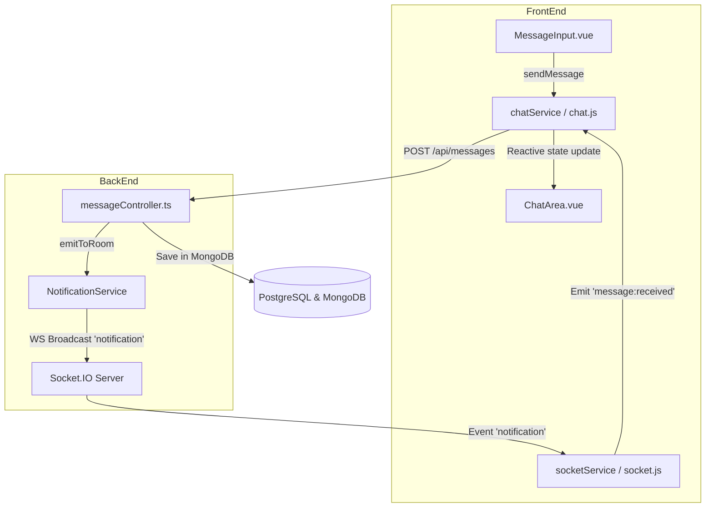

# Real-time Notification System

This document describes the Socket.IO-based real-time notification system implemented in the Eris backend.

## Overview

The notification system uses Socket.IO to send real-time updates to connected clients. It's designed to be flexible and extensible for various types of notifications (server modifications, room updates, messages, user status, etc.).

## Architecture

### Core Components

1. **Socket Configuration** (`src/config/socket.ts`)
   - Initializes and manages the Socket.IO server
   - Handles client connections and disconnections
   - Provides functions to get and close the socket instance

2. **Notification Types** (`src/types/notifications.ts`)
   - Defines TypeScript interfaces for all notification types
   - Ensures type-safe event emission
   - Currently supports:
     - Server events (created, updated, deleted, user joined/left)
     - Message events (received) - Fully implemented for real-time channel chatting
     - Room events (created, updated, deleted) - for future use
     - User status events (online, offline, away, busy) - for future use

3. **Notification Service** (`src/services/notification.service.ts`)
   - Provides methods to emit notifications to different audiences:
     - `emitToAll()`: Broadcast to all connected clients
     - `emitToServer()`: Send to all users in a specific server
     - `emitToRoom()`: Send to all users in a specific room
     - `emitToUser()`: Send to a specific user
   - Helper methods for common notifications:
     - `notifyServerCreated()`
     - `notifyServerUpdated()`
     - `notifyServerDeleted()`
     - `notifyUserJoinedServer()`
     - `notifyUserLeftServer()`

## Server Integration

The Socket.IO server is initialized in `src/index.ts`:

```typescript
import { createServer } from 'http';
import { initializeSocket } from './config/socket';

const httpServer = createServer(app);
initializeSocket(httpServer);

httpServer.listen(port);
```

## Usage Examples

### Sending Notifications from Services

```typescript
import { NotificationService } from './services/notification.service';

// After creating a server
NotificationService.notifyServerCreated(serverId, serverName, ownerId);

// After updating a server
NotificationService.notifyServerUpdated(serverId, { serverName: 'New Name' });

// After deleting a server
NotificationService.notifyServerDeleted(serverId);
```

### Room Management

Clients should join rooms to receive targeted notifications:

```typescript
// Server-side: Join a client to a server room
socket.join(`server:${serverId}`);

// Server-side: Join a client to a user room (for personal notifications)
socket.join(`user:${userId}`);

// Server-side: Join a client to a room
socket.join(`room:${roomId}`);
```

### Client-Side Connection (Example)

```typescript
import { io } from 'socket.io-client';

const socket = io('http://localhost:3000');

socket.on('connect', () => {
  console.log('Connected to server');
});

socket.on('notification', (notification) => {
  console.log('Received notification:', notification);
  
  switch (notification.type) {
    case 'server:created':
      // Handle server creation
      break;
    case 'server:updated':
      // Handle server update
      break;
    case 'server:deleted':
      // Handle server deletion
      break;
    // ... handle other notification types
  }
});
```

## Notification Structure

All notifications follow this base structure:

```typescript
interface Notification {
  type: string;           // e.g., 'server:created'
  timestamp: number;      // Unix timestamp
  data: {
    // Type-specific data
  };
}
```

### Example Notifications

**Server Created:**
```json
{
  "type": "server:created",
  "timestamp": 1678901234567,
  "data": {
    "serverId": "uuid-here",
    "serverName": "My Server",
    "ownerId": "user-uuid"
  }
}
```

**Server Updated:**
```json
{
  "type": "server:updated",
  "timestamp": 1678901234568,
  "data": {
    "serverId": "uuid-here",
    "serverName": "Updated Name"
  }
}
```

## Automated Testing

The system includes comprehensive automated tests:

### Unit Tests (`tests/socket.test.ts`)
- Socket connection and disconnection
- Ping/pong functionality
- Notification emission to all clients
- Targeted notifications (server, room, user)
- Helper method functionality
- Error handling

### Integration Tests (`tests/socket.integration.test.ts`)
- End-to-end server creation with notifications
- Graceful degradation when socket is unavailable
- Database integration verification

Run tests with:
```bash
npm test                              # Run all tests
npm test -- socket.test.ts           # Run socket unit tests only
npm test -- socket.integration.test  # Run integration tests only
```

## Error Handling

The notification system is designed to fail gracefully:

- If Socket.IO is not initialized, notifications will log an error but won't crash the application
- If emitting a notification fails, the error is caught and logged
- Server operations (like creating a server) will succeed even if notifications fail
- The system uses try-catch blocks to prevent notification errors from affecting core functionality
- **Database Out-of-Sync Resilience (User Account Auto-Sync)**: In environments where database volumes have differing persistence lifecycles (e.g., PostgreSQL is reset or migrated anew while PocketBase retains data), authenticated users might exist in PocketBase but be missing from PostgreSQL. The backend service (`UserService`) implements on-the-fly auto-syncing during login or token verification. If a user is successfully validated by PocketBase but has no PostgreSQL record, a PostgreSQL user record is seamlessly created on-the-fly. This guarantees that `req.user.id` is always a valid UUID, preventing database constraint failures in the server, channel, and message models.

## Extending the System

To add new notification types:

1. **Define the type** in `src/types/notifications.ts`:
   ```typescript
   export interface MyNewNotification extends BaseNotification {
     type: 'my-feature:action';
     data: {
       // Your data fields
     };
   }
   ```

2. **Add to the union type**:
   ```typescript
   export type Notification = 
     | ServerCreatedNotification
     | MyNewNotification  // Add here
     | ...;
   ```

3. **Add helper method** (optional) in `src/services/notification.service.ts`:
   ```typescript
   static notifyMyFeature(data: any): void {
     const notification: Notification = {
       type: 'my-feature:action',
       timestamp: Date.now(),
       data,
     };
     this.emitToAll(notification); // or emitToServer, etc.
   }
   ```

4. **Use in your service**:
   ```typescript
   NotificationService.notifyMyFeature({ /* data */ });
   ```

## Performance Considerations

- Notifications are sent asynchronously and don't block the main application flow
- Room-based targeting reduces unnecessary network traffic
- Failed notifications are logged but don't retry automatically
- Consider implementing rate limiting for high-frequency events in the future

**Message Received:**
```json
{
  "type": "message:received",
  "timestamp": 1678901234567,
  "data": {
    "messageId": "msg-uuid-here",
    "roomId": "general",
    "senderId": "user-uuid",
    "senderUsername": "alex",
    "content": "Hello, Eris!"
  }
}
```

---

## Frontend Integration & Reactive Architecture

Eris implements a completely decoupled, reactive, and resilient real-time state synchronization framework on the frontend using Vue 3 and Socket.IO.



### 1. Socket Service (`FrontEnd/src/services/socket.js`)
Manages client WebSocket connections, automatic token-based authentication, and channel subscription lifecycle:
- Automatically appends JWT Authorization headers via `authState.token` during Handshake.
- Listens for generic `'notification'` packets and routes them securely to registered component event listeners.
- Exposes clean hooks for joining and leaving rooms (`joinRoom`, `leaveRoom`).

### 2. Chat Service & Shared Store (`FrontEnd/src/services/chat.js`)
Maintains a shared reactive state `chatState` containing the current room, loading statuses, error handlers, and message lists:
- Coordinates historic message fetching via REST APIs and real-time updates via Socket.IO.
- Performs duplicate prevention checks before appending new real-time messages to the array.
- Handles optimistic message updates when sending messages to guarantee near-instant UI feedback.

### 3. Reactive UI Elements (`ChatArea.vue` & `MessageInput.vue`)
- **`ChatArea.vue`**: Binds to `chatState.messages` and `authState.user`. Custom styled avatars are hashed based on sender usernames, and the scrollbar uses sleek purple glassmorphism styling. Utilizes `nextTick()` and safe check guardrails to automatically scroll to the bottom on message additions.
- **`MessageInput.vue`**: Implements standard `v-model` binding with disabling capabilities during sending, firing standard REST operations upon submission.

---

## Automated Testing

Eris features an outstanding, isolated, and comprehensive test suite across the entire application stack.

### Backend Jest Test Suite (`BackEnd/tests/message.test.ts`)
- Covers message controller operations, route safety validation via `authMiddleware`, and socket broadcasting.
- Tests are run in isolation using dynamic mongoose test setups.
- Run with: `npm test` or `npm test -- message.test`

### Frontend Vitest Test Suite
- Covers component mounting, empty room layouts, dynamic message rendering, reactive class highlighting, scroll guardrails, and message submittal actions.
- Features isolated unit tests for `socket.js` connection parameters and event callback routing.
- Features isolated unit tests for `chat.js` store coordination, optimistic appending, and error processing.
- Run with: `npm test` inside the `FrontEnd` directory.

---

## Future Enhancements

Planned features:
- Room join/leave API endpoints
- Message read receipts
- Typing indicators
- User presence tracking
- Notification persistence for offline users
- Redis adapter for horizontal scaling
